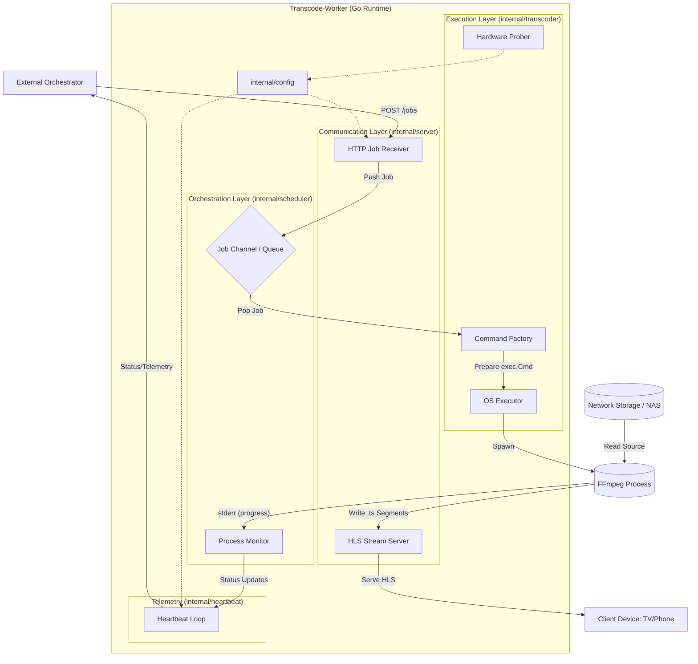

> See [components.md](components.md) before reading this documentation.

## Deep Dive: Component-to-Component Interaction
### A. Server &rarr; Scheduler (The Channel)
Instead of the Server calling a function in the Scheduler directly (which would be "Synchronous" and block the network request), it sends the data into a Go Channel.
- **Example:** `chan models.TranscodeJob`
- Creates an assynchronous brdige. The server can return `202 Accepted` to the Orchestrator immediately, while the scheduler processes the job whenever it has CPU space.
### B. Scheduler &rarr; Transcoder (The Wrapper)
The Scheduler holds a reference to the `Transcoder.Engine`
- **Example:** Pointer Receiver calls `engine.BuildCommand(job).
- The engine is stateless, it just knows how to talk to FFmpeg. The Scheduler is stateful, it know if a job is currently running.
### C. Transcoder &rarr; FFmpeg 
Where go leaves its runtime and talks to the OS.
- **Example:** `os/exec` pipes (`StoudtPipe` and `StderrPipe`)
- Logs are "piped" from FFmpeg back into go. This allows the **Monitor** to parse the text and see if FFmpeg is failing or how many frames it has processed.
### D. Heartbeat &rarr; Everywhere (Shared State)
Hearbeat needs to know what everyone's doing to report it to the Orchestrator
- **Example:**: Shared Atomic Variables or Mutexes.
- Since the hearbeat runs in its own **Goroutine**, its crucial to use thread-safe ways to read "Current CPU Usage" or "Active Job ID" without causing race conditions.
