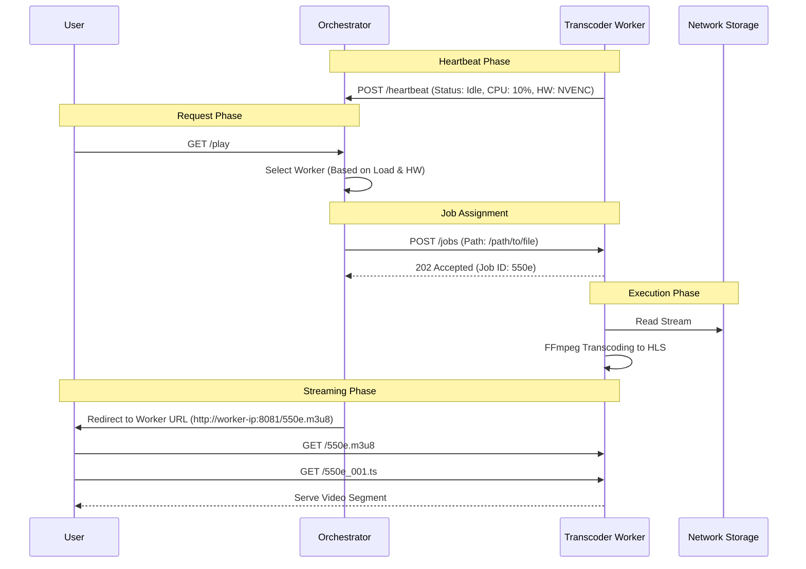
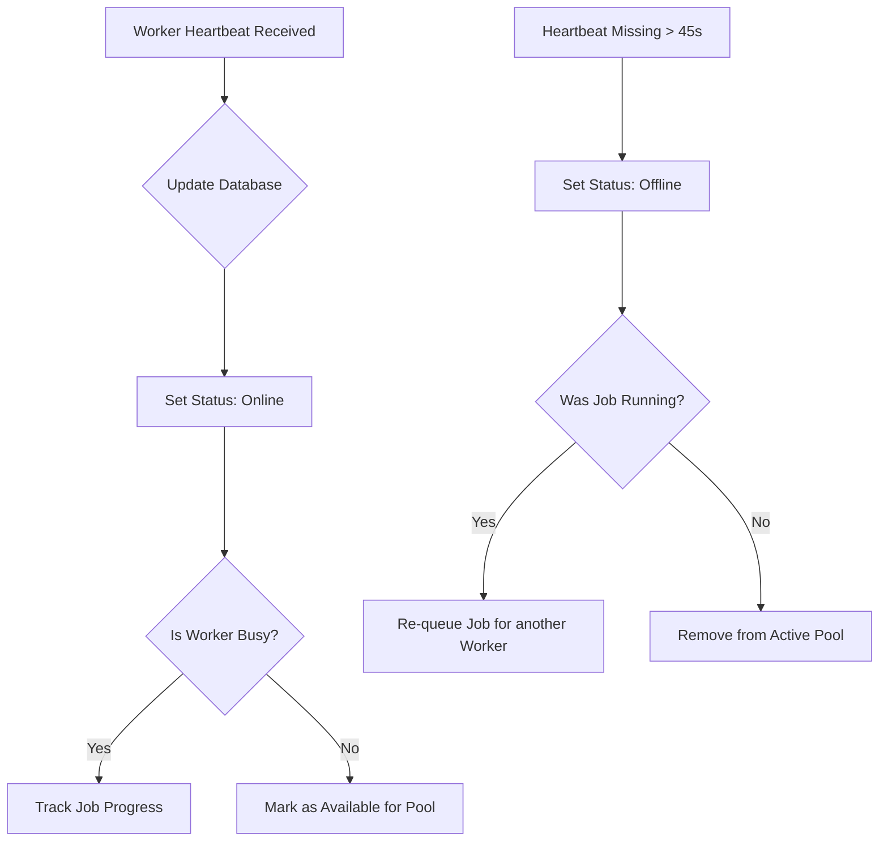

# Orchestration Model
This `transcode-worker` is designed to participate in a distributed orchestration model for media streaming systems. Despite not having the orchestrator in this repository, it is essential to understand how this workflow should work.

In this documentation, I will approach how the overall system is designed to work, not only the `transcode worker`.

## High Level Orchestration Logic
The system follows a **Centralized Coordination** model. The Orchestrator maintains the global state of the library and the health of the worker pool, while the Workers execute discrete, atomics unit of work.

### Communication Patterns
- **Worker to Orchestrator (Upstream):** Periodic, asynchronous status updates (hearbeats).
- **Orchestrator to Worker (Downstream):** Synchronous job dispatch (REST commands).
- **Worker to End-User (Egress):** Direct streaming of media segments (HLS).

## The Global Lifecycle
This diagram illustrates how a single media request travels from the user's TV to the Orchestrator, is processed by a specific Worker, and is delivered back to the user.

## Worker Selection Strategy 
The Orchestrator manages the **Worker Pool** using a weighted scheduling algorithm. This ensures that "low-level" servers (like the Orchestrator itself) aren't overwhelmed with 4K taasks while high-end workers sit idle.

### Selection Criteria
1. **Availability:** Is the worker `last_seen` timestamp within the last 30 seconds?
2. **Capacity:** Is the current `active_jobs` count less than the worker's `max_concurrent_jobs`?
3. **Hardware Match:** Does the file require HEVC decoding? If so, prioritize workers with `hw_accel: true`.
4. **Network Proximity:**(Optional) Prioritize workers on the same subnet as the user.

## State Management & Fault Tolerance
In a distributed system, things fail. The integration is designed to be **self-healing**

### Handling Failures
- **Orchestrator Failure:** The Workers continue to transcode their current jobs but store progress logs locally until the Orchestrator returns.
- **Worker Failure:** The Orchestrator detects a missing heartbeat. It identifies which job was assigned to that node and automatically re-assigns it to the next available worker in the pool.
- **Network Partition:** If a worker loses access to the NAS, it sends an ERROR state in its heartbeat, and the Orchestrator stops sending it new jobs.
